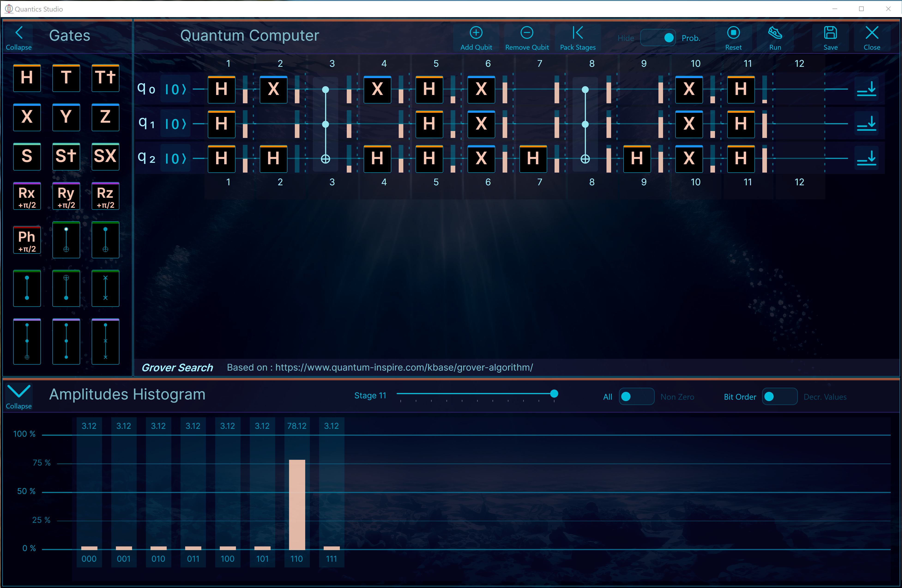

Quantum Computing: Quantics Engine / Quantics Studio 

A simple math engine for computations required by Quantum Computing along with a desktop based user interface to design and test quantum circuits. 
Save and reload your circuits. 
Analyse results and amplitude probabilities.
Built-in circuits.

The logic of computation engine is based on this design: 
: https://www.stylewarning.com/posts/quantum-interpreter/

Note: Work in progress, bugs are lurking...

|    .Net 9.0    Supported platforms              |
|-------------------------------------------------|
| :heavy_check_mark: Windows - Visual Studio 2022 |
| :heavy_check_mark: macOS   - Jet Brains Rider   |
| :heavy_check_mark: Unix    - Jet Brains Rider   |

## License 
This software is free. 
This software is proposed to you under the terms of the MIT license. 
For details, check out the LICENSE document on this webpage.

## Install
For now there is no installation "Wizard". You have to build it.

## Build your own... Make changes, fix a bug...
All you need is:
for Windows: 
Install the free Visual Studio 2022 Community Edition, or the Pro or Enterprise. 
for Mac or Unix: 
Install the 'Free for non-commercial use' Jet Brains Ryder Edition, or the Pro or Enterprise. 

Clone the repo', open the solution, build, etc.