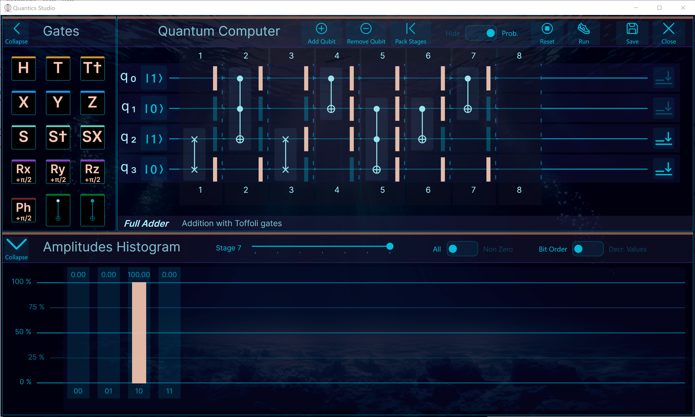

## Quantum Computing: Quantics Engine / Quantics Studio 

A simple math engine for computations required by Quantum Computing along with a desktop based user interface to design and test quantum circuits. 
Save and reload your circuits. 
Analyse results and amplitude probabilities.
Built-in circuits.

|    .Net 9.0    Supported platforms              |
|-------------------------------------------------|
| :heavy_check_mark: Windows - Visual Studio 2022 |
| :heavy_check_mark: macOS   - Jet Brains Rider   |
| :heavy_check_mark: Unix    - Jet Brains Rider   |

## Notes
Originally, the logic of the computation engine was based on this design: 
: https://www.stylewarning.com/posts/quantum-interpreter/ limiting the engine to be only able to manipulate 10 qubits.
This has been significantly improved and optimized so that the engine is now able to handle up to 18 qubits. 
However, starting at 16 qubits calculations become very slow.

The User Interface is portable to various OS and is based on the Avalonia 
cross-platform UI framework for dotnet, available here: https://github.com/AvaloniaUI/Avalonia
Avalonia supports running on the browser, therefore this app' will maybe have a browser version in some future.

Matrix and tensor calculations are handled by Math.Net Numerics, available here: https://numerics.mathdotnet.com/

Warning! This is still work in progress, and bugs are lurking...

## License 
This software is free. 
This software is proposed to you under the terms of the MIT license. 
For details, check out the LICENSE document on this webpage.

## Install
For now there is no installation "Wizard". You have to build it from source code.

## Build your own... Make changes, fix a bug...
All you need is:

for Windows: 
Install the free Visual Studio 2022 Community Edition, or the Pro or Enterprise. 

for Mac or Unix: 
Install the 'Free for non-commercial use' Jet Brains Ryder Edition, or the Pro or Enterprise. 

First clone the Lyt.Avalonia.Framework repository.
Then clone this repo' in the same root folder, open the solution, build, etc.

